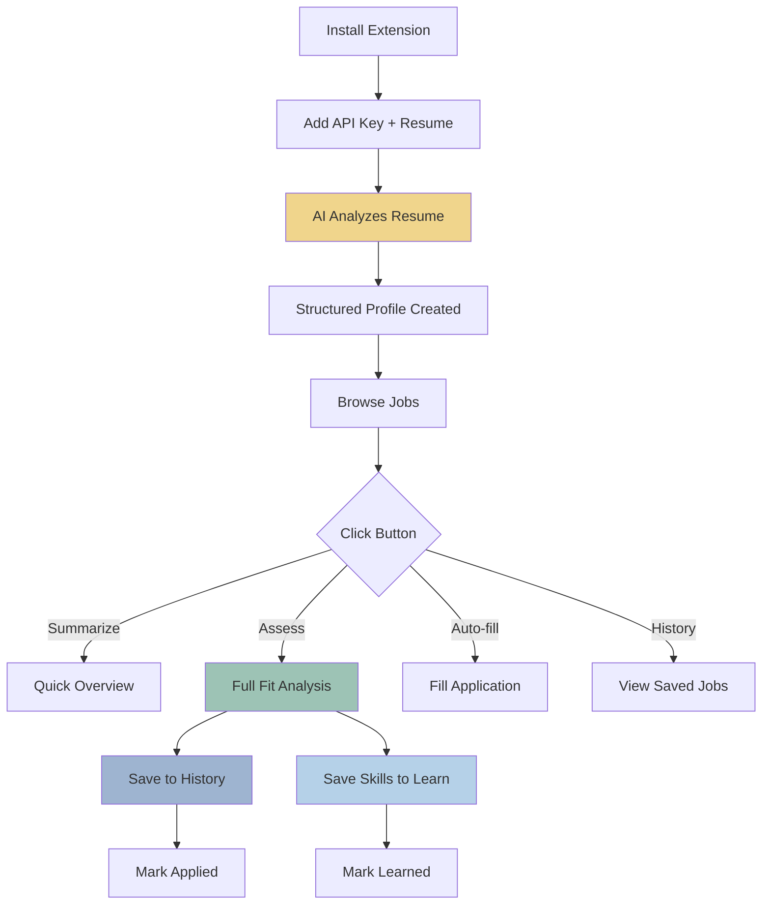
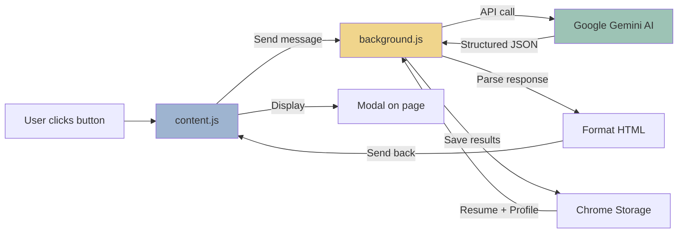
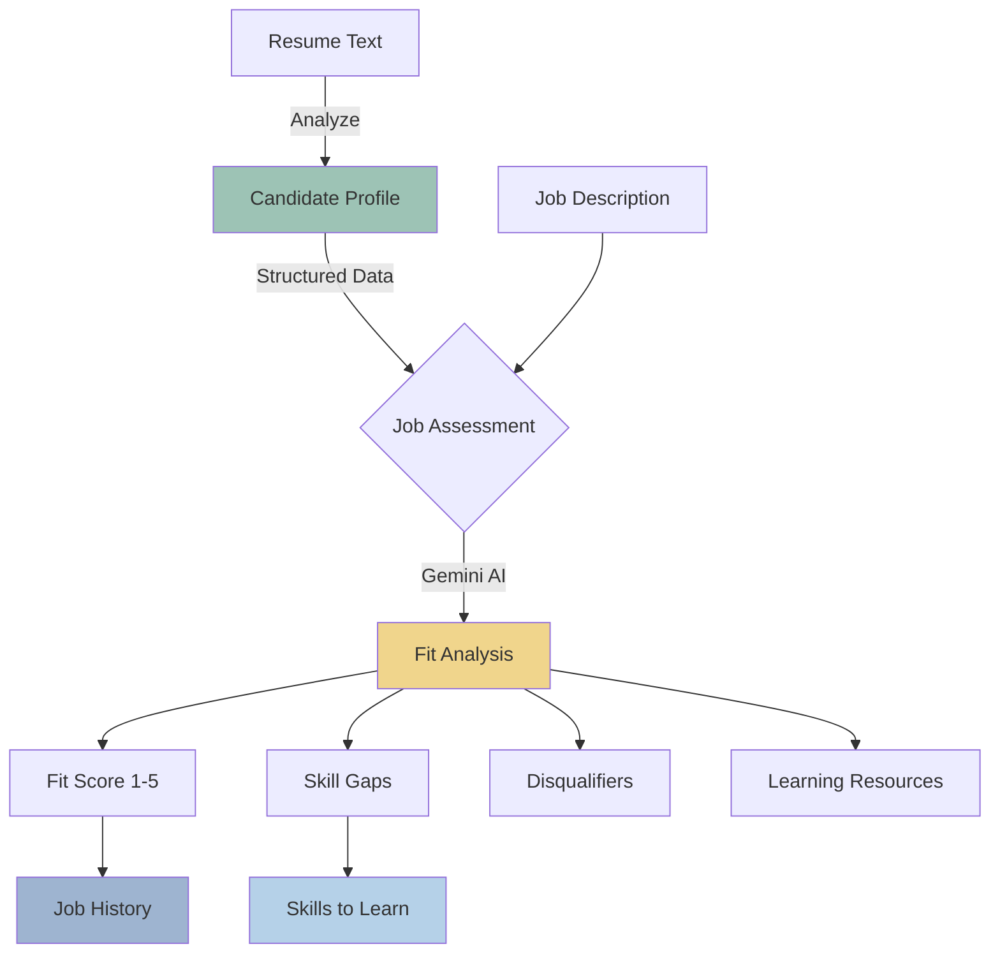
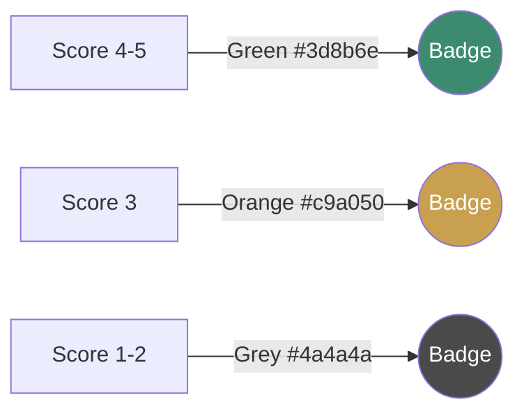

# CareerFit AI

<p align="center">
  
</p>

<p align="center">
  <em>A Chrome extension that uses AI to instantly assess how well your resume matches any job posting.</em>
</p>

## The Problem

Job hunting is exhausting. You spend hours reading job descriptions, trying to figure out if you're qualified. Should you apply? Is it a stretch? What skills are you missing?

## The Solution

CareerFit AI analyzes job postings against your resume in seconds, giving you:

- **Fit Score (1-5)** - Instantly know if a job is worth your time
- **Gap Analysis** - See exactly what skills you're missing
- **Learning Resources** - Get specific courses/books to close skill gaps
- **Auto-Fill** - Automatically fill common application questions (no API cost)

## Screenshots

### Extension in Action

<table>
<tr>
<td width="50%">

#### Button Bar on Job Page

*Extension buttons overlaid on LinkedIn job posting*

</td>
<td width="50%">

#### Minimized View (Close-up)

*Starts minimized, click + to expand*

</td>
</tr>
<tr>
<td colspan="2">

#### Full Assessment Results

*AI-powered fit assessment with score, gaps, disqualifiers, and personalized learning resources*

</td>
</tr>
<tr>
<td width="50%">

#### Assessment Detail View

*Detailed breakdown of fit analysis*

</td>
<td width="50%">

#### Skills Tracking & Learning

*Save skills from gaps, track learning progress*

</td>
</tr>
<tr>
<td colspan="2">

#### Job History & Application Tracking

*Track your job applications across 5 organized tabs: All Jobs, Interested, Applied, To Learn, Learned*

</td>
</tr>
</table>

> See `output-preview.html` for a live preview of all UI components.

## Features

| Feature | Description |
|---------|-------------|
| **Summarize** | Extract key requirements (years, IC vs Manager, unique skills) |
| **Assess** | Full AI analysis with fit score, gaps, and learning resources |
| **History** | Track jobs with 5-tab view: All Jobs, Interested, Applied, To Learn, Learned |
| **Skills Tracking** | Save skills to learn from gaps, mark as learned when complete |
| **Apply Workflow** | Mark jobs as Scanned, Interested, or Applied |
| **Auto-Fill** | Fill work authorization, diversity questions, and more |

## How It Works



### One-Time Setup
1. Paste your resume in Options
2. Click "Analyze My Resume" - AI extracts a structured profile with:
   - Years of experience and seniority level
   - Technical skills with years (all skills found)
   - Certifications, functions, industries (all industries from every job)

### On Any Job Page
Button bar starts minimized (Assess only). Click + to expand all buttons:
- **Summarize** - Quick role overview
- **Assess** - Deep fit analysis against your profile
- **Auto-fill** - Fill application form fields
- **History** - View/manage job history

### Profile-Based Matching
Your resume is converted to structured data for job matching:
```
EXPERIENCE: 7 years | Level: Senior
EDUCATION: MBA in Business (Kelley School)
FUNCTIONS: Product Management, Strategy
INDUSTRIES: Tech, E-commerce, CPG, SaaS, B2B

TECHNICAL SKILLS:
- SQL (5 years)
- Python (3 years)
- Tableau (4 years)
- Agile (6 years)

CERTIFICATIONS: PMP, AWS Solutions Architect
```

This compact format enables fast, accurate matching against job requirements.

## Architecture



### Data Flow



## Supported Sites

- LinkedIn Jobs
- Indeed
- Interstride
- Greenhouse job boards
- Lever job boards
- Application auto-fill on Workday, Greenhouse, Lever

## Tech Stack

- **AI**: Google Gemini 2.5 Flash with structured JSON output
- **Frontend**: Vanilla JS, Chrome Extension Manifest V3
- **Build**: Webpack 5, Babel
- **Storage**: Chrome sync/local storage (optional Firebase sync)

## Design

UI uses WGSN 2025 trend palette - combining restorative and minimal qualities with comforting soft pastels:

### Color Palette

| Preview | Name | Hex | Pantone | Usage |
|---------|------|-----|---------|-------|
|  | Healing Yellow | `#F0D58C` | 12-0825 TCX | Pending skills, accents |
|  | Calming Green | `#9DC3B5` | 14-4807 TCX | Learned skills, success states |
|  | Circular Grey | `#6B7B7C` | 17-5104 TCX | Secondary text |
|  | Creamy White | `#F5F3E7` | 11-0107 TCX | Button backgrounds, tags |
|  | Elemental Blue | `#9EB4D0` | 15-3920 TCX | Links, secondary actions |
|  | Ice Blue | `#B5D1E8` | 14-4112 TCX | Highlights |

### Current Theme: Green + Cream Hybrid



**Typography:** 12px base, 11px tabs, 38px score badge

**Button Styles:**
- Action buttons: Creamy White (#F5F3E7) background with Dark Green (#2d6b52) text
- Score badges: Green (#3d8b6e) for 4-5, Orange (#c9a050) for 3, Grey (#4a4a4a) for 1-2
- Tab styling: Black text (#222) active, Grey (#666) inactive

See `output-preview.html` for a live preview of all UI components.

## Installation

1. Clone the repo
2. Run `npm install && npm run build`
3. Open `chrome://extensions/` → Enable Developer Mode
4. Click "Load unpacked" → Select the project folder
5. Get a [Gemini API key](https://aistudio.google.com/apikey)
6. Right-click extension icon → Options → Paste API key and resume
7. Click "Analyze My Resume" to generate your profile

## Privacy

- Your resume stays in Chrome's local storage
- Job data is only sent to Google's Gemini API for analysis
- No tracking, no ads, no data collection

## License

MIT
